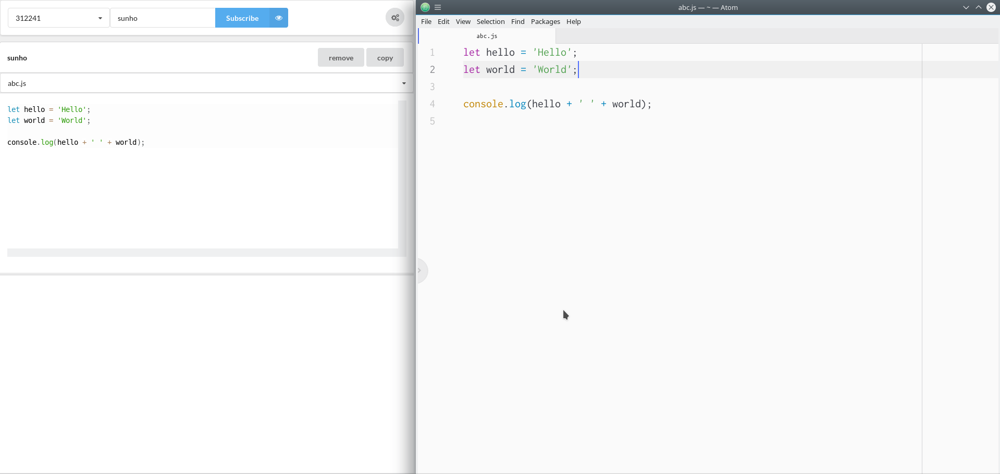

# Introduction
🚿 A simple code monitoring web system. 

# Brief explanantion
 - **server** directory includes a back-end server made with go. It supports recieving data from clients(atom pugin) and provides an api for administration.
 - **client** directory includes an administration client made with typescript which supports monitoring clients connected to the server.
# Installation

## initial

    go get github.com/ksunhokim123/shower-server/server
The reason why use github.com/ksunhokim123/shower-server/server instead of github.com/ksunhokim123/shower-server is to download go dependencies.

## go part
Go to [GOPATH](https://github.com/golang/go/wiki/GOPATH)/src/github.com/ksunhokim123/shower-server/server/api.go and replace "user" of USERNAME and "pass" of PASSWORD with your wanted admin id and pw. And then go to .../server and execute this command.

    go build
Then you can execute the server via

    ./server

## js part
Go to [GOPATH](https://github.com/golang/go/wiki/GOPATH)/src/github.com/ksunhokim123/shower-server/client/constant.ts. And replace **http://sunho.kim/shower** with your ip address or domain.  And then goto .../client directory and execute this commands.

    npm install
    npx webpack -p --config webpack.config.prod.js
Then you should see **dist** directory. You can simply run **dist/index.html** or provide the whole directory via nginx, apache or any other web servers.

## Setting the client

Now you can download **code-shower** package in your atom and assign your server address with **packages>Code Shower>set server**.
